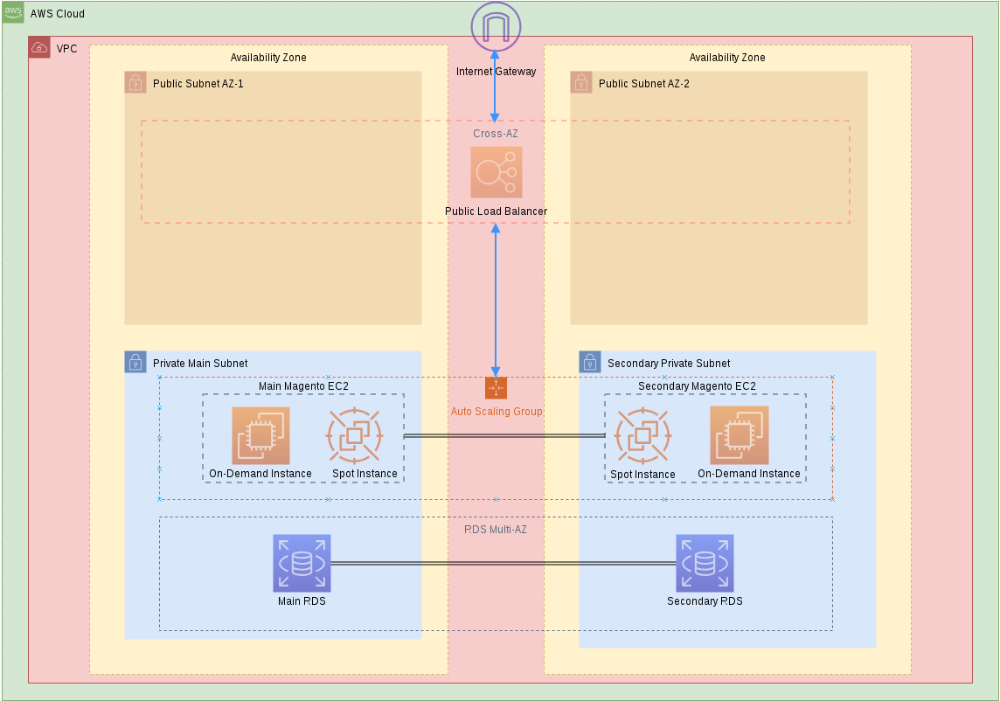
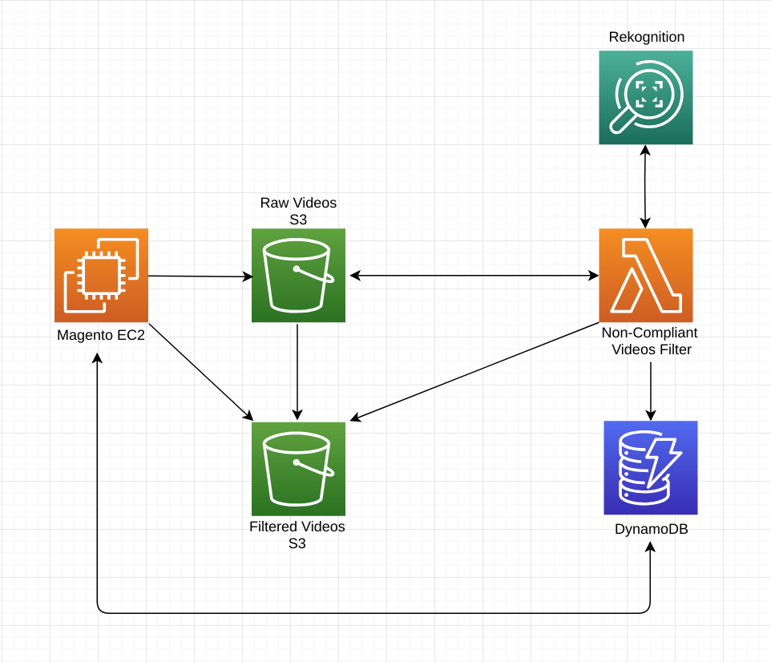
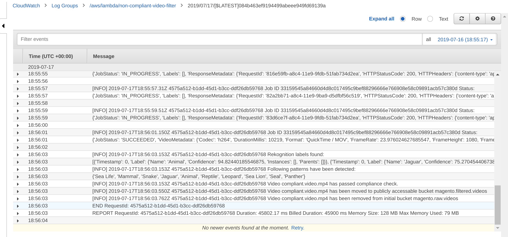

# magento_app
## Magent Infrastructure Diagram and reproduciton steps
-------



### Run it in on AWS: 

- `git clone https://github.com/Koklarus/magento_app.git`
- Create a bucket for CF templates and upload them:
  ``` bash
  export region="AWS region of your choice"
  
  export templates_bucket="A name for s3 bucket"
  
  export profile="Your AWS profile"

  export stack_name="A name for your stack"
  
  aws s3api create-bucket --bucket $templates_bucket --region $region --profile $profile
  
  cd magento_app
  
  aws s3 sync . s3://$templates_bucket --exclude "*git*" --profile $profile
  ```
- Create CF Stack:
  ``` bash
  aws cloudformation create-stack --stack-name $stack_name --template-body file://1.magento.stack.yaml --capabilities CAPABILITY_IAM --profile $profile
  ```
- Whatch CF Stack creation either on AWS console or run:
  ``` bash
  aws cloudformation describe-stacks --stack-name $stack_name --profile $profile

## Lambda Diagram and reproduciton steps
-------
High Level Diagram Overview:



- `git clone https://github.com/Koklarus/magento_app.git`
- `cd magento_app/magento_lambda`
- `export profile=<your aws profile>`
- Upload Lambda function to S3 as a zip file:
  ``` bash 
  export lambda_bucket=$(aws cloudformation describe-stacks --stack-name magento --profile $profile | jq -r '.Stacks | .[] | .Parameters | .[] | select(.ParameterKey=="LambdaBucket") | .ParameterValue')
  
  zip video-filter.zip video-filter.py &&  aws s3 cp video-filter.zip s3://$lambda_bucket --profile $profile 
  ```
- `aws cloudformation create-stack --stack-name <stack-name> --template-body file://1.lambda.setup.yaml --capabilities CAPABILITY_IAM --profile $profile`
- Check progress: `aws cloudformation describe-stacks --stack-name <stack-name> --profile $profile`
- Add Lambda function event notification trigger to S3 bucket, run in bash:
  ``` bash
  export source_bucket_name=$(aws cloudformation describe-stacks --stack-name magento --profile $profile | jq -r '.Stacks | .[] | .Parameters | .[] | select(.ParameterKey=="DataSrcBucket") | .ParameterValue')
  
  export function_name=$(aws cloudformation describe-stacks --stack-name magento --profile $profile | jq '.Stacks | .[].Outputs | .[].OutputValue')
  
  aws s3api put-bucket-notification-configuration --bucket $source_bucket_name --notification-configuration '{"LambdaFunctionConfigurations": [{"Events": ["s3:ObjectCreated:*"], "Id":"69696","LambdaFunctionArn": '$function_name'}]}' --profile $profile

  ```
 ### Lambda function test:
- Upload videos files to DataSrcBucket:
  ``` bash
  aws s3 cp s3://video.samples.magento/compliant.video.mp4 s3://$bucket_name --profile $profile
  aws s3 cp s3://video.samples.magento/non.compliant.video.mp4 s3://$bucket_name --profile $profile
  ```
- Analyze Lambda's CloudWatch Logs

